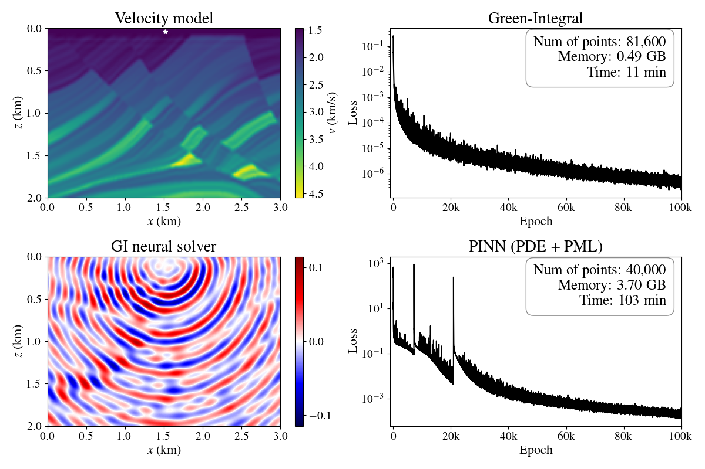

Reproducible material for **"A Green-integral--constrained neural solver with stochastic physics-informed regularization" - Mohammad Mahdi Abedi, David Pardo, and Tariq Alkhalifah.**

## Overview

<p align="center">
  
</p>
<p align="center">
  <em><b>Performance comparison on the complex Marmousi velocity model.</b> The proposed Green-Integral solver successfully resolves the highly oscillatory scattered wavefield (bottom-left). Compared to standard PINNs with PMLs, the GI solver yields a more stable convergence, requires less GPU memory, and trains almost <b>10x faster</b>.</em>
</p>

Standard Physics-Informed Neural Networks (PINNs) struggle to resolve highly oscillatory scattered wavefields in heterogeneous media. Relying purely on local PDE residuals can lead to non-physical solutions and requires computationally expensive boundary conditions (like PMLs). 

This repository implements a **Green-Integral (GI) neural solver** that overcomes these limitations. By enforcing global consistency through the Lippmann-Schwinger integral equation, the neural network inherently satisfies the Sommerfeld radiation condition, eliminating the need for PMLs and second-order spatial derivatives. Consequently, this formulation drastically reduces peak GPU memory usage and training time while achieving superior predictive accuracy.
## Project structure
This repository is organized as follows:
* :open_file_folder: **gi_solver**: The core python package containing the mathematical utilities and neural network architectures.
* :open_file_folder: **scripts**: Main executable python scripts used to train the models and run inference.
* :open_file_folder: **data**: Contains all the data, including the velocity models, validation grids, precomputed GI grids, and pool of collocation points.
* :open_file_folder: **PreTrained_Models**: Contains the saved `.keras` neural network models for various configurations.
* :open_file_folder: **asset**: Contains the README figures.

### Scripts
The following executable scripts are provided in the `scripts` folder:
- :page_facing_up: ``GI_Helmholtz_training.py``: The main training script. Configure parameters here to train the GI solver or the hybrid GI+PDE solver on different velocity models.
- :page_facing_up: ``inference_GI_paper.py``: Script to load a pre-trained model and plot the predicted scattered wavefields against the ground truth.

### Core Package (`gi_solver`)
The backend library powering the solver is organized into the following modules:
- :page_facing_up: ``My_utilities_GI.py``: Core physics utilities containing the FFT-accelerated Green-Integral loss functions, PDE loss terms, and grid building functions.
- :page_facing_up: ``models.py``: Defines the TensorFlow/Keras neural network architectures (e.g., the embedder layers and the main solver network).

## Getting started 
To ensure reproducibility of the results, we provide an `environment.yml` file to exactly replicate the training environment.
Alternatively, you can install the core dependencies via pip:

```bash
pip install tensorflow numpy matplotlib scipy
```
To train a new model, navigate to the scripts folder, configure your parameters in GI_Helmholtz_training.py, and run:

```bash
python GI_Helmholtz_training.py
```
Disclaimer: All experiments have been carried out on a server equipped with an AMD EPYC 7763 64-Core Processor and an NVIDIA L40S GPU. Different environment configurations or hardware architectures (e.g., Apple Silicon or different NVIDIA generations) may require adjustments to the environment.yml or hyperparameter tuning.


